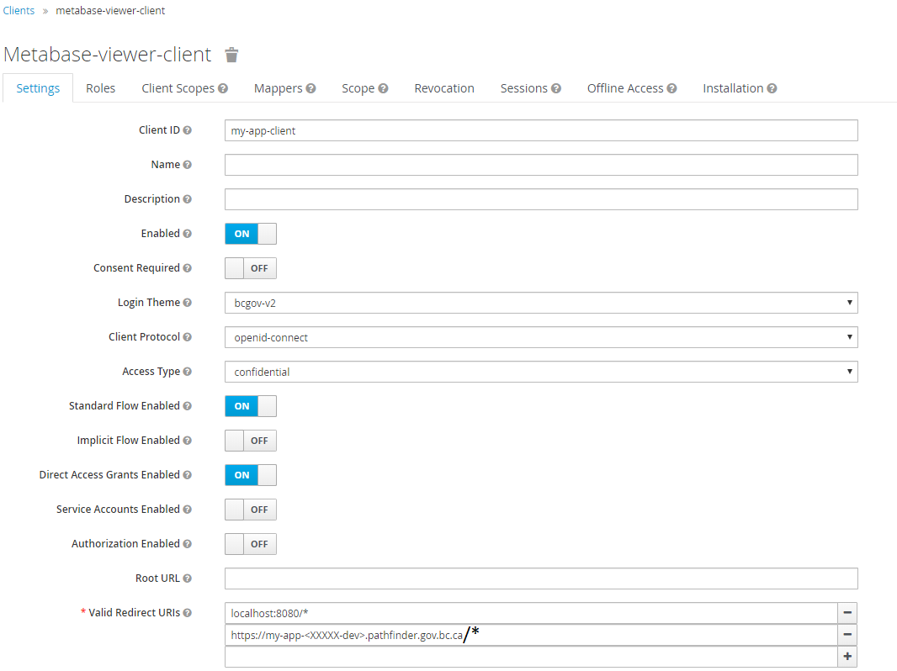
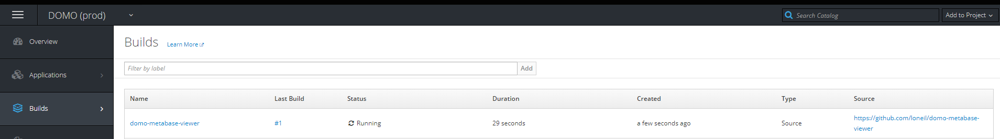
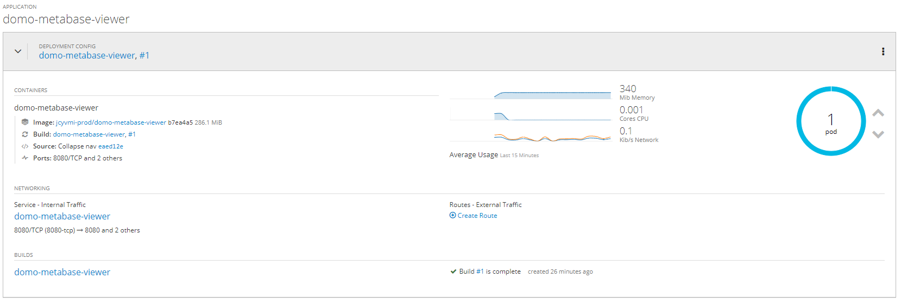
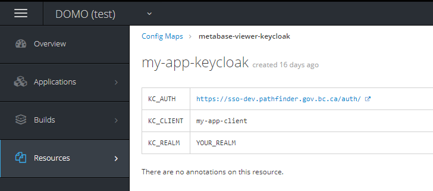
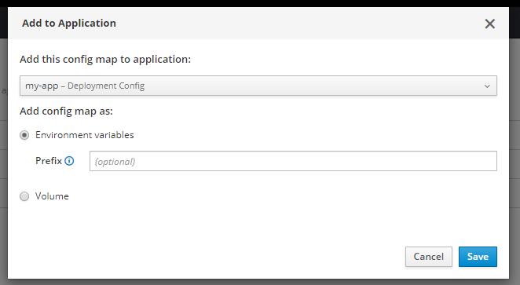
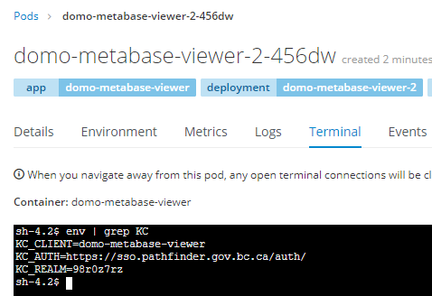

# Overview
Under construction

Screenshots in this documentation are using an OpenShift project called "DOMO" and an application called "domo-metabase-viewer." So if you see any references to those names in the screenshots they are just from the example used to construct this guide.  
You should not need to reference itThat project can be presently found at https://github.com/loneil/domo-metabase-viewer, but may be subject to change.

## Prerequisites
Under construction

## Configure Existing Keycloak Realm
under construction

### Add Client for Application

Create a new client that will be used by your application. Name it in a way related to the app you're creating (my-app as you called it in a previous step).
  
**Access Type** - confidential
**Valid Redirect URIs** - You can add localhost:8080/* (or whatever your local setup is) while testing out locally. Add the route you will eventually navigate to in the deployed app (find out the )


## Setting up Spring Boot Application
under construction

## Creating New Application in OpenShift
under construction

### S2i Image
Under construction 

### Set Up Environment Config
Under construction

### OC New App 
Log in to the OpenShift project that you are wanting to deploy to in the typical manner with Copy Login Command.  
From your command line (you don't need to be in the same folder as your Java app) run the login command and connect to your project.
```shell script
oc login https://console.pathfinder.gov.bc.ca:8443 --token=<your token>
oc project <namespace>
```
Then you will run `oc new app` with the s2i image and your Spring Boot application. (this assumes you're using master branch)
```shell script
 oc new-app redhat-openjdk18-openshift~https://github.com/<your github project>
```
From here you should be able to see the app building in your project's Builds space.


After a few minutes, the build will complete, trigger the deployment created by the new-app command, and start up a pod, which will run your Spring Boot JAR that was built.   
You can see the completed (or in progress) deployment on your Overview tab.

At this point it's worth going in to the deployment and poking around to familiarize yourself.

### Add Environment Variables
UNDER CONST

While setting up your application properties you referred to environment variables for the Keycloak connection details. You will now set those up in OpenShift so that your deployed application will access them.
In a healthy, more evolved, DevOps paradigm, you would have these configuration values set up as part of your infrastructure-as-code and pipeline so that you would be able to recreate the necessary environment should you need to start from scratch.  
For this demo we will create them manually to get a sense of how it fits together.

Go into the `Resources > Config Maps` section in the OpenShift project and hit Create Config Map.

Name your map `my-app-keycloak` and add 3 key value pairs (fill in Key and Value, then hit Add Item).  
Populate these with your Keycloak connection details set up earlier.

After adding the values the config map should look like this.


From here you will need to add this map to your deployed application so they are picked up by the environment.  
Hit the Add to Application button in the top right of the summary of your Config Map.  
Select the name of the deployment you just created in the previous step and Save.



This will immediately trigget a redeployment of your app. Go to Overview and wait for the pod deployment to complete.

You can verify created environment variables by going in to the pod, selecting Terminal, and `env` command to list them (maybe pipe to `grep` to narrow it down)



### Expose Route
From the deployment panel in Overview you can click the Create Route link.  
You can customize this as needed, but for this example leave the defaults to make a route using your project name in the hostname.  
For the Security section select `Secure route` and use the following values:  
TLS Termination - Edge  
Insecure Traffic - Redirect  
Accept the changes, this will results in a route in the format of https://<deployment-name>-<project-name>.pathfinder.gov.bc.ca  

Give it a few seconds to set up the routing and then you should be able to navigate to your deployed application.

## Next Steps